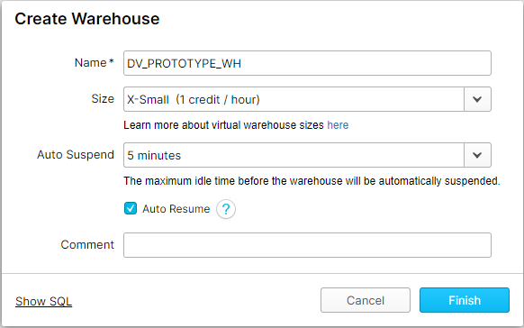

## Download the demonstration project

Assuming you already have a python environment installed, the next step is to download the latest 
demonstration project from the repository.

Using the button below, find the latest release and download the zip file, listed under assets.

<a href="https://github.com/Datavault-UK/snowflakeDemo/releases" class="btn">
<i class="fa fa-download"></i> View Downloads
</a>

Once downloaded, unzip the project.

## Installing requirements

Once you have downloaded the project, install all of the requirements from the provided ```requirements.txt``` file.
First make sure the ```requirements.txt``` file is in your current working directory, then run:

```pip install -r requirements.txt```

This will install dbt and all of its dependencies, ready for 
development with dbt.

## Install dbtvault

Next, we need to install dbtvault. 
dbtvault has already been added to the ```packages.yml``` file provided with the example project, so all you need to do 
is run the following command:
 
```dbt deps```

## Setting up dbtvault with Snowflake

In the provided dbt project file (```dbt_project.yml```) the profile is named ```snowflake-demo```.
In your dbt profiles, you must create a connection with this name and provide the snowflake
account details so that dbt can connect to your Snowflake databases. 

dbt provides their own documentation on how to configure profiles, so we suggest reading that
[here](https://docs.getdbt.com/v0.15.0/docs/configure-your-profile).

A sample profile configuration is provided below which will get you started:

```profiles.yml```
```yaml
snowflake-demo:
  target: dev
  outputs:
    dev:
      type: snowflake
      account: <bu77777.eu-west-1>

      user: <myusername>
      password: <mypassword>

      role: <SYSADMIN>
      database: DV_PROTOTYPE_DB
      warehouse: DV_PROTOTYPE_WH
      schema: DEMO
      threads: 4
      client_session_keep_alive: False
```

Replace everything in this configuration marked with```<>``` with your own Snowflake account details.

Key points:

- You must also create a ```DV_PROTOTYPE_DB``` database and ```DV_PROTOTYPE_WH``` warehouse.


- Your ```DV_PROTOTYPE_WH``` warehouse should be X-Small in size and have a 5 minute auto-suspend, as we will
not be coming close to the limits of what Snowflake can process.


- The role can be anything as long as it has full rights to the above schema and database, so we suggest the
default ```SYSADMIN```.

- We have set ```threads``` to 4 here. This setting dictates how 
many models are processed in parallel. In our experience, 4 is a reasonable amount and the full system is created in a 
reasonable time-frame, however, you may run with as many threads as required. 




## The project file

As of v0.5, the ```dbt_project.yml``` file is now used as a metadata store. Below is an example file showing the
metadata for a single instance of each of the current table types. 

```dbt_project.yml```
```yaml 

models:
  snowflakeDemo:
    load:
      schema: "VLT"
      enabled: true
      materialized: incremental
      stage:
        schema: "STG"
        enabled: true
        materialized: view
      raw:
        schema: "RAW"
        enabled: true
        materialized: incremental
      hubs:
        enabled: true
        hub_customer:
          vars:
            source: 'v_stg_orders'
            src_pk: 'CUSTOMER_PK'
            src_nk: 'CUSTOMER_KEY'
            src_ldts: 'LOADDATE'
            src_source: 'SOURCE'
        ...
      links:
        enabled: true
        link_customer_nation:
          vars:
            source: 'v_stg_orders'
            src_pk: 'LINK_CUSTOMER_NATION_PK'
            src_fk:
              - 'CUSTOMER_PK'
              - 'NATION_PK'
            src_ldts: 'LOADDATE'
            src_source: 'SOURCE'
        ...
      sats:
        enabled: true
        sat_order_customer_details:
          vars:
            source: 'v_stg_orders'
            src_pk: 'CUSTOMER_PK'
            src_hashdiff: 'CUSTOMER_HASHDIFF'
            src_payload:
              - 'NAME'
              - 'ADDRESS'
              - 'PHONE'
              - 'ACCBAL'
              - 'MKTSEGMENT'
              - 'COMMENT'
            src_eff: 'EFFECTIVE_FROM'
            src_ldts: 'LOADDATE'
            src_source: 'SOURCE'
        ...
      t_links:
        enabled: true
        t_link_transactions:
          vars:
            source: 'v_stg_transactions'
            src_pk: 'TRANSACTION_PK'
            src_fk:
              - 'CUSTOMER_FK'
              - 'ORDER_FK'
            src_payload:
              - 'TRANSACTION_NUMBER'
              - 'TRANSACTION_DATE'
              - 'TYPE'
              - 'AMOUNT'
            src_eff: 'EFFECTIVE_FROM'
            src_ldts: 'LOADDATE'
            src_source: 'SOURCE'
        ...
  vars:
    date: TO_DATE('1992-01-08')
```

#### models

Here we are specifying that models in the ```load``` directory should be loaded in to the ```VLT```
schema, and models in the sub-directories ```stage``` and ```source``` should have their own schemas, 
```STG``` and ```SRC``` respectively. We have also specified that they are all enabled, as well
as their materialization. Many of these attributes are also provided in the files themselves and take
precedence over these settings anyway, this is just a design choice. 

#### table metadata

The table metadata is now provided, as of v0.5, in the ```dbt_project.yml``` file as seen in the above example. 
For each of your table models you must specify the metadata using the correct hierarchy. The metadata provided here is
for the ```hub_customer.sql```, ```link_customer_nation.sql```, and ```sat_order_customer_details.sql``` models.

#### global vars

On line 73, we have vars that will apply to all models. 
To simulate day-feeds, we use a variable we have named ```date``` which is used in the ```SRC``` models to
load for a specific date. This is described in more detail in the [Profiling TPC-H](sourceprofile.md) section.