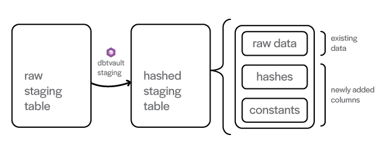

The dbtvault package assumes you've already loaded a Snowflake database staging table with raw data 
from a source system or feed.

There are a few conditions that need to be met for the dbtvault package to work:

- All records are for the same ```load_datetime```
- The table is truncated & loaded with data for each load cycle

The raw staging table needs to be pre processed to add extra columns of data to make it ready to load to the raw vault.
Specifically, we need to add primary key hashes, hashdiffs, and any implied fixed-value columns (see the diagram).

!!! info
    - Hashing of primary keys is optional in Snowflake
    - Natural keys alone can be used
    - We've implemented hashing as the only option, for now
    - A non-hashed version will be added in future releases

### Creating the model header

First we create a new dbt model. Our source table is called ```stg_customer``` 
and we should name our additional layer ```stg_orders_hashed```, although any sensible naming convention will work if 
kept consistent. In this case, we create a new file ```stg_orders_hashed.sql``` in our models folder.

!!! info
    We are using the name ```stg_orders_hashed``` for reasons that will become clear as we progress through the guide.
    Our hubs, links and satellites will require more than just customer data, and so ```orders``` makes more sense.

Let's start by adding the model header to the file:

```stg_orders_hashed.sql```
```sql

{{- config(materialized='view', schema='MYSCHEMA', enabled=true, tags='staging') -}}

```

This is a simple header block. You may add tags if necessary, the important parts are the materialization type and 
our schema name:

- The ```materialized``` parameter defines how our table will be materialised in our database. 
Usually we want hashing layers to be views.
- The ```schema``` parameter is the name of the schema where this staging table will be created.

### Setting the source table

Next we will create a variable which holds a reference to the raw source table, since we will need to refer to it a few times
in our model.

```stg_orders_hashed.sql```
```sql hl_lines="3"

{{- config(materialized='view', schema='MYSCHEMA', enabled=true, tags='staging') -}}


```

For more information on the ```source``` macro, please refer [here](gettingstarted.md#setting-up-sources)

### Adding the metadata

Now we get into the core component of staging: the metadata. 
The metadata consists of the column names we want to hash, and the alias for our new 
column containing the hash representation.

We need to call the [multi_hash](macros.md#multi_hash) macro and provide the appropriate parameters. The macro takes
our provided column names and generates all of the necessary SQL for us. More on how to use this macro is 
provided in the link above.

After adding the macro call, our model will now look something like this:

```stg_orders_hashed.sql```
```sql hl_lines="5 6 7"

{{- config(materialized='view', schema='MYSCHEMA', enabled=true, tags='staging') -}} 


                                                                                     
{{ dbtvault.multi_hash([('CUSTOMER_ID', 'CUSTOMER_PK'),
                        ('NATION_ID', 'NATION_PK'),
                        (['CUSTOMER_ID', 'NATION_ID'], 'CUSTOMER_NATION_PK')])   -}},
```

!!! note
    Make sure you add the trailing comma after the call, at the end of line 7.
    
This call will:

- Hash the ```CUSTOMER_ID``` column, and create a new column called ```CUSTOMER_PK``` containing the hash 
value.
- Hash the ```NATION_ID``` column, and create a new column called ```NATION_PK``` containing the hash 
value.
- Concatenate the values in the ```CUSTOMER_ID``` and ```NATION_ID``` columns and hash them, creating a new
column called ```CUSTOMER_NATION_PK``` containing the hash of the combination of the values.

The latter two pairs will be used later when creating [links](links.md).
    
### Additional columns

With the [add_columns](macros.md#add_columns) macro, we can provide a list of columns and any corresponding aliases for 
those columns.

We now add the column names we want to bring forward/feed from the raw staging table into the raw vault.
To include all columns which exist in the source table, we provide the ```source_table``` variable we created earlier.

We will also need to add some additional columns to our staging layer, containing 'constants' implied by the context of the 
staging data. For example, we may add a source table code value, or the the load date, or some other constant needed in
the primary key.

We can also override any columns coming in from the source, with different data. We may want to do this if a source 
column already exists in the raw stage and the values aren't appropriate.
 
We provide the constant by adding a ```!``` to the data and alias them with the same name as the column we want to 
override. You will have another opportunity to rename these columns, as well as cast them to different data types
later when creating the raw vault tables. We can also use this method to create any new columns which do not already 
exist in the source.


```stg_orders_hashed.sql```
```sql hl_lines="9 10 11"

{{- config(materialized='view', schema='MYSCHEMA', enabled=true, tags='staging') -}} 


                                                                                     
{{ dbtvault.multi_hash([('CUSTOMER_ID', 'CUSTOMER_PK'),
                        ('NATION_ID', 'NATION_PK'),
                        (['CUSTOMER_ID', 'NATION_ID'], 'CUSTOMER_NATION_PK')])   -}},

{{ dbtvault.add_columns(source_table,
                        [('!1', 'SOURCE'),
                         ('LOADDATE', 'EFFECTIVE_FROM')])                         }}

```

!!! success "New"
    We are now no longer required to provide columns which already exist in the source table,
    as providing the ```source_table``` parameter in ```add_columns``` will now bring in all the columns
    for us. 
    
    
In the example above we have have:

- Added a header (line 1).
- Set the source_table variable to our raw staging table (line 3).
- Defined some hashing to create primary keys (lines 5-7).
- Brought in all of the raw staging table's columns (line 9).
- Added a ```SOURCE``` column with the constant value ```1``` (line 10).
- Added an ```EFFECTIVE_FROM``` column which uses the ```LOADDATE``` value as its value (line 11).
    
### Adding the footer

!!! success "New"
    The ```staging_footer``` macro has been renamed to ```from``` and is now much simpler.
    If you're looking for the ability to add constants for ```source``` and ```loaddate```, 
    you can now use the improved [add_columns](macros.md#add_columns) macro.
    

Now we just need to provide the variable we created earlier, as a parameter to the [from](macros.md#from)
macro.

After adding the footer, our completed model should now look like this:

```stg_orders_hashed.sql```
```sql hl_lines="13"

{{- config(materialized='view', schema='MYSCHEMA', enabled=true, tags='staging') -}} 


                                                                                     
{{ dbtvault.multi_hash([('CUSTOMER_ID', 'CUSTOMER_PK'),
                        ('NATION_ID', 'NATION_PK'),
                        (['CUSTOMER_ID', 'NATION_ID'], 'CUSTOMER_NATION_PK')])   -}},

{{ dbtvault.add_columns(source_table,
                        [('LOADDATE', 'EFFECTIVE_FROM'),
                         ('!1', 'SOURCE')])                                       }}

{{ dbtvault.from(source_table)                                                    }}

``` 

This model is now ready to run to create a view with all the added data/columns needed to load the raw vault.

### Running dbt

With our model complete, we can run dbt and have our new staging layer materialised as configured in the header:

```dbt run --models stg_orders_hashed```

And our table will look like this:

| CUSTOMER_PK  | NATION_PK    | CUSTOMER_NATION_PK  | (source table columns) | EFFECTIVE_FROM | SOURCE       |
| ------------ | ------------ | ------------------- | ---------------------- | -------------- | ------------ |
| B8C37E...    | D89F3A...    | 72A160...           | .                      | 1993-01-01     | 1            |
| .            | .            | .                   | .                      | .              | .            |
| .            | .            | .                   | .                      | .              | .            |
| FED333...    | D78382...    | 1CE6A9...           | .                      | 1993-01-01     | 1            |

### Next steps

Now that we have implemented a new staging layer with all of the required fields and hashes, we can start loading our vault
with hubs, links and satellites.