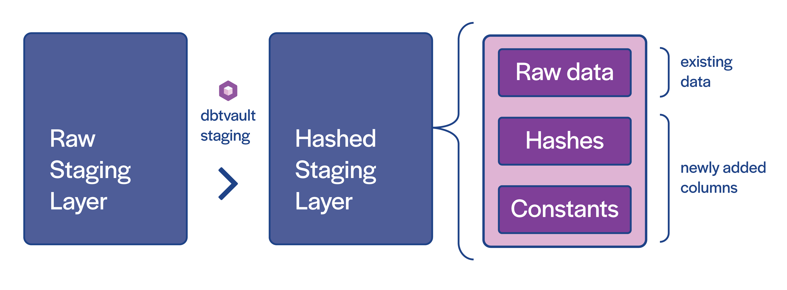

The dbtvault package assumes you've already loaded a Snowflake database staging table with raw data 
from a source system or feed (the 'raw staging layer').

### Pre-conditions

There are a few conditions that need to be met for the dbtvault package to work:

- All records are for the same ```load_datetime```
- The table is truncated & loaded with data for each load cycle

Instead of truncating and loading, you may also build a view over the table to filter out the right records and load 
from the view.

### Let's Begin

The raw staging table needs to be pre-processed to add extra columns of data to make it ready to load to the raw vault.
Specifically, we need to add primary key hashes, hashdiffs, and any implied fixed-value columns (see the diagram).

We also need to ensure column names align with target hub or link tables.

!!! info
    Hashing of primary keys is optional in Snowflake and natural keys alone can be used in place of hashing. 
    
    We've implemented hashing as the only option for now, though a non-hashed version will be added in future releases.
    
## Creating the model

To prepare our raw staging layer for loading the vault, we create a dbt model and call dbtvault staging macros with 
provided metadata. 

Our model will consist of:

- a header
- a source table declaration
- metadata passed to staging macros.
- a footer

### Creating the model header

First we create a new dbt model. Our source table is called ```stg_customer``` 
so we should name our additional layer ```stg_customer_hashed```, although any sensible naming convention will work if 
kept consistent. In this case, we create a new file ```stg_customer_hashed.sql``` in our models folder.

Let's start by adding the model header to the file:

```stg_customer_hashed.sql```
```sql

{{- config(materialized='view', schema='MYSCHEMA', enabled=true, tags='staging') -}}

```

This is a simple header block. You may add further tags if necessary, for your own needs, the important parts are the 
materialization type and the schema name:

- The ```materialized``` parameter defines how our table will be materialised in our database. 
Usually we want hashing layers to be views, as they build upon the raw staging layer. 
- The ```schema``` parameter is the name of the schema where this staging table will be created.

### Setting the source table

Next we will create a variable which holds a reference to the raw source table, since we will need to refer to it a few times
in our model.

!!! note
    On line 3 below we are using a dbt source. 
    
    If you have not yet set up sources in your dbt configuration please refer to [setting up sources](walkthrough.md#setting-up-sources).


```stg_customer_hashed.sql```
```sql hl_lines="3"

{{- config(materialized='view', schema='MYSCHEMA', enabled=true, tags='staging') -}}


```

### Generating hashes from metadata

Now we get into the core component of staging: the metadata. 
The metadata consists of the column names we want to use in our hash, to use as primary keys in our data vault or to use as 
hashdiffs for satellites (see the DV 2.0 book for detail of what these are) and the alias for our new hash column.

We need to call the [multi_hash](macros.md#multi_hash) macro and provide the appropriate parameters. The macro takes
our provided lists of columns, iterates through each of them, and generates all of the necessary SQL to create the hash for us. More on how to use this macro is 
provided in the link above.

After adding the macro call, our model will now look something like this:

```stg_customer_hashed.sql```
```sql hl_lines="5 6 7 8 9 10"

{{- config(materialized='view', schema='MYSCHEMA', enabled=true, tags='staging') -}} 
                                                                                 

                                                                                   
{{ dbtvault.multi_hash([('CUSTOMER_KEY', 'CUSTOMER_PK'),                           
                        ('NATION_KEY', 'NATION_PK'),                               
                        (['CUSTOMER_KEY', 'NATION_KEY'], 'CUSTOMER_NATION_PK'),     
                        (['CUSTOMER_KEY', 'CUSTOMER_NAME',                         
                          'CUSTOMER_PHONE', 'CUSTOMER_DOB'],                      
                         'CUSTOMER_HASHDIFF', true)])                            -}},
```

!!! note
    Make sure you add the trailing comma after the call, at the end of line 9.
    
This call will:

- Hash the ```CUSTOMER_KEY``` column, and create a new column called ```CUSTOMER_PK``` containing the hash 
value.
- Hash the ```NATION_KEY``` column, and create a new column called ```NATION_PK``` containing the hash 
value.
- Concatenate the values in the ```CUSTOMER_KEY``` and ```NATION_KEY``` columns and hash them in the order supplied, creating a new
column called ```CUSTOMER_NATION_PK``` containing the hash of the combination of the values.
- Concatenate the values in the ```CUSTOMER_KEY```, ```CUSTOMER_NAME```, ```CUSTOMER_PHONE```, ```CUSTOMER_DOB``` 
columns and hash them, creating a new column called ```CUSTOMER_NATION_PK``` containing the hash of the 
combination of the values. The ```true``` parameter should be provided so that the columns are alpha-sorted. 

The latter three pairs will be used later when creating [links](links.md) and [satellites](satellites.md).
    
### Additional columns

With the [add_columns](macros.md#add_columns) macro, we can provide a list of columns and any corresponding aliases for 
those columns.

We now add the column names we want to bring forward/feed from the raw staging table into the raw vault.
To include all columns which exist in the source table, we provide the ```source_table``` variable we created earlier.

We will also need to add some additional columns to our staging layer, containing 'constants' implied by the context of the 
staging data. For example, we can add a source table code value for audit purposes, the load date, or some other constant needed in
the primary key.

We can also override any columns coming in from the source, with different data. We may want to do this if a source 
column already exists in the raw stage and the values aren't appropriate.
 
We provide a constant by adding an ```!``` to the data and alias them with the same name as the column we want to 
override. We can also use this method to create any new columns which do not already 
exist in the source.


```stg_customer_hashed.sql```
```sql hl_lines="12 13 14"

{{- config(materialized='view', schema='MYSCHEMA', enabled=true, tags='staging')    -}} 


                                                                                     
{{ dbtvault.multi_hash([('CUSTOMER_KEY', 'CUSTOMER_PK'),
                        ('NATION_KEY', 'NATION_PK'),
                        (['CUSTOMER_KEY', 'NATION_KEY'], 'CUSTOMER_NATION_PK'),
                        (['CUSTOMER_KEY', 'CUSTOMER_NAME',
                          'CUSTOMER_PHONE', 'CUSTOMER_DOB'], 
                          'CUSTOMER_HASHDIFF', true)]) -}},

{{ dbtvault.add_columns(source_table,
                        [('!1', 'SOURCE'),
                         ('LOADDATE', 'EFFECTIVE_FROM')])                            }}

```

In summary, above we have:

- Added a header (line 1).
- Set the source_table variable to our raw staging table (line 3).
- Defined some hashing to create primary keys and a hashdiff (lines 5-10).
- Brought in all of the raw staging table's columns (line 12).
- Added a ```SOURCE``` column with the constant value ```1``` (line 13).
- Added an ```EFFECTIVE_FROM``` column which uses the ```LOADDATE``` value as its value (line 11).
    
### Adding the footer

Now we just need to provide the ```source_table``` variable we created earlier, as a parameter to the [from](macros.md#from)
macro.

After adding the footer, our completed model should now look like this:

```stg_customer_hashed.sql```
```sql hl_lines="16"

{{- config(materialized='view', schema='MYSCHEMA', enabled=true, tags='staging')    -}} 


                                                                                     
{{ dbtvault.multi_hash([('CUSTOMER_KEY', 'CUSTOMER_PK'),
                        ('NATION_KEY', 'NATION_PK'),
                        (['CUSTOMER_KEY', 'NATION_KEY'], 'CUSTOMER_NATION_PK'),
                        (['CUSTOMER_KEY', 'CUSTOMER_NAME',
                          'CUSTOMER_PHONE', 'CUSTOMER_DOB'], 
                          'CUSTOMER_HASHDIFF', true)]) -}},

{{ dbtvault.add_columns(source_table,
                        [('!1', 'SOURCE'),
                         ('LOADDATE', 'EFFECTIVE_FROM')])                            }}

{{ dbtvault.from(source_table)                                                       }}

``` 

This model is now ready to run to create a view with all the added data/columns needed to load the raw vault.

### Running dbt

With our model complete, we can run dbt and have our new staging layer materialised as configured in the header:

```dbt run --models stg_customer_hashed```

And our table will look like this:

| CUSTOMER_PK  | NATION_PK    | CUSTOMER_NATION_PK  | CUSTOMER_HASHDIFF   | (source table columns) | EFFECTIVE_FROM | SOURCE       |
| ------------ | ------------ | ------------------- | ------------------- | ---------------------- | -------------- | ------------ |
| B8C37E...    | D89F3A...    | 72A160...           | .                   | .                      | 1993-01-01     | 1            |
| .            | .            | .                   | .                   | .                      | .              | .            |
| .            | .            | .                   | .                   | .                      | .              | .            |
| FED333...    | D78382...    | 1CE6A9...           | .                   | .                      | 1993-01-01     | 1            |

### Next steps

Now that we have implemented a new staging layer with all of the required fields and hashes, we can start loading our vault
with hubs, links and satellites.